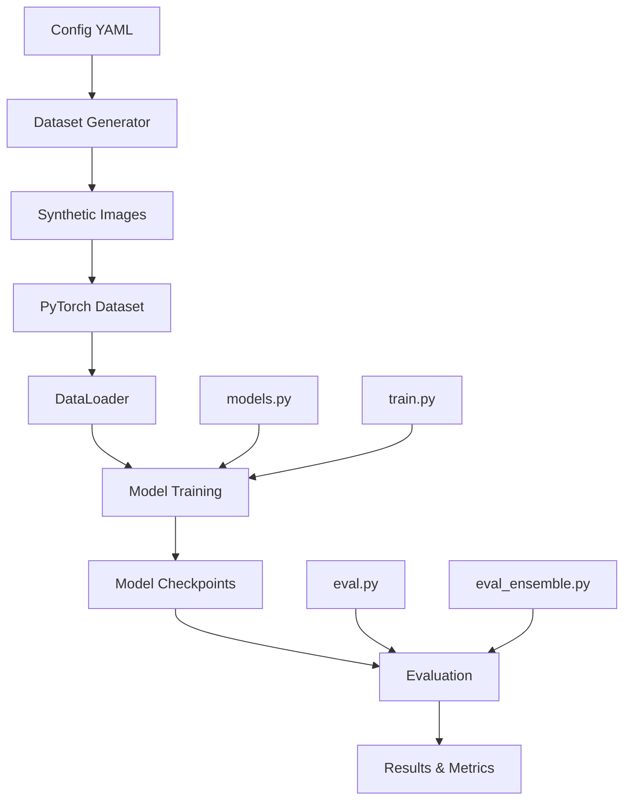

# 🔧 Technical Implementation Details

This document provides detailed technical information about the implementation of our gravitational lens classification system.

## Table of Contents

- [Architecture Overview](#architecture-overview)
- [Code Structure](#code-structure)
- [Data Pipeline](#data-pipeline)
- [Model Implementation](#model-implementation)
- [Training Pipeline](#training-pipeline)
- [Evaluation Framework](#evaluation-framework)
- [Performance Optimization](#performance-optimization)
- [Error Handling](#error-handling)

## Architecture Overview



## Code Structure

### Core Modules

```
src/
├── 🧠 models.py              # Model architectures and factory functions
├── 📁 dataset.py             # PyTorch Dataset implementation
├── 🏋️ train.py               # Training script with CLI
├── 📊 eval.py                # Individual model evaluation
├── 🤝 eval_ensemble.py       # Ensemble evaluation
├── 🎨 make_dataset_scientific.py  # Dataset generation
└── ☁️ cloud_train.py         # Cloud deployment utilities
```

### Configuration System

```yaml
# configs/realistic.yaml
General:
  n_train: 1800
  n_test: 200
  image_size: 64
  seed: 42
  balance: 0.5
  backend: "synthetic"

LensArcs:
  brightness_min: 0.2
  brightness_max: 0.6
  curvature_min: 0.3
  curvature_max: 0.8
  # ... more parameters
```

## Data Pipeline

### Dataset Generation Flow

```python
# make_dataset_scientific.py
@dataclass
class DatasetConfig:
    general: GeneralConfig
    noise: NoiseConfig
    lens_arcs: LensArcConfig
    galaxy_blob: GalaxyBlobConfig
    output: OutputConfig
    validation: ValidationConfig
    debug: DebugConfig

def generate_dataset(config: DatasetConfig) -> None:
    """Main dataset generation pipeline."""
    
    # 1. Validate configuration
    validate_config(config)
    
    # 2. Initialize generators
    generator = SyntheticImageGenerator(config)
    
    # 3. Generate images with atomic writes
    for split in ['train', 'test']:
        images, labels = generator.generate_split(split)
        atomic_write_images(images, split_dir)
        atomic_write_csv(labels, csv_path)
    
    # 4. Validate output
    validate_output_integrity(output_dir)
```

### PyTorch Dataset Implementation

```python
# dataset.py
class LensDataset(Dataset):
    """PyTorch Dataset for gravitational lens images."""
    
    def __init__(self, data_root: str, split: str, img_size: int = 64, 
                 augment: bool = False, validate_paths: bool = True):
        
        self.data_root = Path(data_root)
        self.split = split
        self.img_size = img_size
        self.augment = augment
        
        # Load CSV with error handling
        csv_path = self.data_root / f"{split}.csv"
        try:
            self.df = pd.read_csv(csv_path)
        except FileNotFoundError:
            raise FileNotFoundError(f"CSV file not found: {csv_path}")
        
        # Validate image paths
        if validate_paths:
            self._validate_image_paths()
        
        # Setup transforms
        self.transform = self._get_transforms()
        
        logger.info(f"Loaded {len(self.df)} samples: {dict(self.df['label'].value_counts())}")
    
    def _get_transforms(self) -> transforms.Compose:
        """Get image transforms based on configuration."""
        transform_list = [
            transforms.Resize((self.img_size, self.img_size)),
            transforms.ToTensor(),
            transforms.Normalize(mean=[0.485, 0.456, 0.406], 
                               std=[0.229, 0.224, 0.225])  # ImageNet stats
        ]
        
        if self.augment:
            # Add augmentations for training
            transform_list.insert(-2, transforms.RandomHorizontalFlip(0.5))
            transform_list.insert(-2, transforms.RandomRotation(10))
            transform_list.insert(-2, transforms.ColorJitter(brightness=0.1, contrast=0.1))
        
        return transforms.Compose(transform_list)
    
    def __getitem__(self, idx: int) -> Tuple[torch.Tensor, int]:
        """Get a single sample."""
        row = self.df.iloc[idx]
        
        # Load and process image
        img_path = self.data_root / row['image_path']
        try:
            image = Image.open(img_path).convert('RGB')
            image = self.transform(image)
        except Exception as e:
            logger.error(f"Error loading image {img_path}: {e}")
            raise
        
        label = int(row['label'])
        return image, label
```

## Model Implementation

### Unified Model Factory

```python
# models.py
SUPPORTED_ARCHITECTURES = {
    'resnet18': {
        'model_fn': models.resnet18,
        'weights': ResNet18_Weights.DEFAULT,
        'input_size': 64,
        'description': 'ResNet-18 Convolutional Neural Network'
    },
    'vit_b_16': {
        'model_fn': models.vit_b_16,
        'weights': ViT_B_16_Weights.DEFAULT,
        'input_size': 224,
        'description': 'Vision Transformer Base with 16x16 patches'
    }
}

class LensClassifier(nn.Module):
    """Unified wrapper for different architectures."""
    
    def __init__(self, arch: str, pretrained: bool = True, 
                 dropout_rate: float = 0.5, num_classes: int = 1):
        super().__init__()
        
        if arch not in SUPPORTED_ARCHITECTURES:
            raise ValueError(f"Unsupported architecture: {arch}")
        
        self.arch = arch
        model_config = SUPPORTED_ARCHITECTURES[arch]
        weights = model_config['weights'] if pretrained else None
        
        # Load backbone
        self.backbone = model_config['model_fn'](weights=weights)
        
        # Adapt final layer for binary classification
        self._adapt_classifier_head(dropout_rate)
        
        logger.info(f"Created {model_config['description']} with {self._count_parameters():,} parameters")
    
    def _adapt_classifier_head(self, dropout_rate: float) -> None:
        """Adapt the final layer for binary classification."""
        if self.arch in ['resnet18', 'resnet34']:
            # ResNet: Replace fc layer
            in_features = self.backbone.fc.in_features
            self.backbone.fc = nn.Sequential(
                nn.Dropout(dropout_rate),
                nn.Linear(in_features, 1)  # Binary classification
            )
        elif self.arch == 'vit_b_16':
            # ViT: Replace heads.head layer
            in_features = self.backbone.heads.head.in_features
            self.backbone.heads.head = nn.Sequential(
                nn.Dropout(dropout_rate),
                nn.Linear(in_features, 1)
            )
    
    def forward(self, x: torch.Tensor) -> torch.Tensor:
        """Forward pass."""
        return self.backbone(x)
```

## Training Pipeline

### Training Loop Implementation

```python
# train.py
def train_epoch(model: nn.Module, dataloader: DataLoader, 
                criterion: nn.Module, optimizer: torch.optim.Optimizer, 
                device: torch.device) -> Tuple[float, float]:
    """Train for one epoch."""
    model.train()
    running_loss = 0.0
    correct_predictions = 0
    total_samples = 0
    
    for batch_idx, (images, labels) in enumerate(dataloader):
        # Move to device
        images = images.to(device)
        labels = labels.float().to(device)
        
        # Forward pass
        optimizer.zero_grad()
        outputs = model(images).squeeze(1)
        loss = criterion(outputs, labels)
        
        # Backward pass
        loss.backward()
        optimizer.step()
        
        # Statistics
        running_loss += loss.item()
        predictions = (torch.sigmoid(outputs) >= 0.5).float()
        correct_predictions += (predictions == labels).sum().item()
        total_samples += labels.size(0)
    
    epoch_loss = running_loss / len(dataloader)
    epoch_acc = correct_predictions / total_samples
    
    return epoch_loss, epoch_acc

def main():
    """Main training function."""
    # Parse arguments
    args = parse_arguments()
    
    # Setup logging and reproducibility
    setup_logging()
    set_random_seeds(args.seed)
    
    # Create model
    model = build_model(args.arch, pretrained=args.pretrained)
    device = torch.device("cuda" if torch.cuda.is_available() else "cpu")
    model.to(device)
    
    # Create data loaders
    train_dataset = LensDataset(args.data_root, 'train', 
                               img_size=args.img_size, augment=True)
    train_loader = DataLoader(train_dataset, batch_size=args.batch_size, 
                             shuffle=True, num_workers=args.num_workers)
    
    # Training setup
    criterion = nn.BCEWithLogitsLoss()
    optimizer = optim.AdamW(model.parameters(), lr=args.learning_rate, 
                           weight_decay=args.weight_decay)
    scheduler = optim.lr_scheduler.ReduceLROnPlateau(optimizer, patience=3)
    
    # Training loop
    best_val_loss = float('inf')
    for epoch in range(args.epochs):
        # Train
        train_loss, train_acc = train_epoch(model, train_loader, criterion, optimizer, device)
        
        # Validate
        val_loss, val_acc = validate_epoch(model, val_loader, criterion, device)
        
        # Save best model
        if val_loss < best_val_loss:
            best_val_loss = val_loss
            save_checkpoint(model, optimizer, epoch, val_loss, 
                          f"checkpoints/best_{args.arch}.pt")
        
        # Learning rate scheduling
        scheduler.step(val_loss)
        
        logger.info(f"Epoch {epoch+1:2d}/{args.epochs} | "
                   f"train_loss={train_loss:.4f} train_acc={train_acc:.3f} | "
                   f"val_loss={val_loss:.4f} val_acc={val_acc:.3f}")
```

## Evaluation Framework

### Comprehensive Metrics Calculation

```python
# eval.py
def calculate_metrics(y_true: np.ndarray, y_prob: np.ndarray, 
                     y_pred: np.ndarray) -> Dict[str, float]:
    """Calculate comprehensive evaluation metrics."""
    
    # Basic metrics
    accuracy = accuracy_score(y_true, y_pred)
    precision = precision_score(y_true, y_pred, zero_division=0)
    recall = recall_score(y_true, y_pred, zero_division=0)
    f1 = f1_score(y_true, y_pred, zero_division=0)
    
    # ROC metrics
    try:
        roc_auc = roc_auc_score(y_true, y_prob)
    except ValueError:
        roc_auc = float('nan')
    
    # Confusion matrix components
    tn, fp, fn, tp = confusion_matrix(y_true, y_pred).ravel()
    
    # Scientific metrics
    sensitivity = tp / (tp + fn) if (tp + fn) > 0 else 0.0  # Recall
    specificity = tn / (tn + fp) if (tn + fp) > 0 else 0.0
    ppv = tp / (tp + fp) if (tp + fp) > 0 else 0.0  # Precision
    npv = tn / (tn + fn) if (tn + fn) > 0 else 0.0
    
    return {
        'accuracy': accuracy,
        'precision': precision,
        'recall': recall,
        'f1_score': f1,
        'roc_auc': roc_auc,
        'sensitivity': sensitivity,
        'specificity': specificity,
        'ppv': ppv,
        'npv': npv,
        'true_positives': int(tp),
        'false_positives': int(fp),
        'true_negatives': int(tn),
        'false_negatives': int(fn)
    }
```

### Ensemble Evaluation

```python
# eval_ensemble.py
def get_ensemble_predictions(models: Dict[str, nn.Module], 
                           data_loaders: Dict[str, DataLoader], 
                           device: torch.device) -> Tuple[np.ndarray, np.ndarray, np.ndarray]:
    """Generate ensemble predictions from multiple models."""
    
    all_labels = None
    all_probs = {}
    
    for arch_name, model in models.items():
        model.eval()
        labels_list = []
        probs_list = []
        
        with torch.no_grad():
            for images, labels in data_loaders[arch_name]:
                images = images.to(device)
                logits = model(images).squeeze(1)
                probs = torch.sigmoid(logits)
                
                labels_list.append(labels.numpy())
                probs_list.append(probs.cpu().numpy())
        
        current_labels = np.concatenate(labels_list)
        current_probs = np.concatenate(probs_list)
        
        # Ensure consistency across models
        if all_labels is None:
            all_labels = current_labels
        else:
            assert np.array_equal(all_labels, current_labels), "Label mismatch between models"
        
        all_probs[arch_name] = current_probs
    
    # Simple averaging ensemble
    ensemble_probs = np.mean(list(all_probs.values()), axis=0)
    ensemble_preds = (ensemble_probs >= 0.5).astype(int)
    
    return all_labels, ensemble_probs, ensemble_preds
```

## Performance Optimization

### Memory Management

```python
# Memory-efficient data loading
def create_dataloader(dataset: Dataset, batch_size: int, 
                     num_workers: int = 2) -> DataLoader:
    """Create optimized DataLoader."""
    return DataLoader(
        dataset,
        batch_size=batch_size,
        shuffle=True,
        num_workers=num_workers,
        pin_memory=torch.cuda.is_available(),  # Faster GPU transfer
        persistent_workers=num_workers > 0,    # Avoid worker respawn
        prefetch_factor=2 if num_workers > 0 else None  # Prefetch batches
    )
```

### GPU Optimization

```python
# Mixed precision training (for GPU)
from torch.cuda.amp import GradScaler, autocast

def train_epoch_mixed_precision(model, dataloader, criterion, optimizer, device):
    """Training with mixed precision for faster GPU training."""
    model.train()
    scaler = GradScaler()
    
    for images, labels in dataloader:
        images, labels = images.to(device), labels.to(device)
        
        optimizer.zero_grad()
        
        # Forward pass with autocast
        with autocast():
            outputs = model(images).squeeze(1)
            loss = criterion(outputs, labels.float())
        
        # Backward pass with gradient scaling
        scaler.scale(loss).backward()
        scaler.step(optimizer)
        scaler.update()
```

### CPU Optimization

```python
# CPU-friendly settings for laptop training
def get_cpu_optimized_config():
    """Get configuration optimized for CPU training."""
    return {
        'batch_size': 32,           # Smaller batch for memory
        'num_workers': 2,           # Limited parallelism
        'pin_memory': False,        # No GPU
        'persistent_workers': True, # Reuse workers
        'img_size': 64,            # Smaller images for ResNet
    }
```

## Error Handling

### Robust File Operations

```python
# make_dataset_scientific.py
def atomic_write_image(image: np.ndarray, filepath: Path) -> None:
    """Atomically write image to prevent corruption."""
    temp_path = filepath.with_suffix(filepath.suffix + '.tmp')
    
    try:
        # Write to temporary file first
        Image.fromarray(image).save(temp_path)
        
        # Atomic rename (prevents partial writes)
        temp_path.rename(filepath)
        
    except Exception as e:
        # Clean up temporary file on error
        if temp_path.exists():
            temp_path.unlink()
        logger.error(f"Failed to write image {filepath}: {e}")
        raise

def atomic_write_csv(df: pd.DataFrame, filepath: Path) -> None:
    """Atomically write CSV to prevent corruption."""
    temp_path = filepath.with_suffix(filepath.suffix + '.tmp')
    
    try:
        df.to_csv(temp_path, index=False)
        temp_path.rename(filepath)
    except Exception as e:
        if temp_path.exists():
            temp_path.unlink()
        logger.error(f"Failed to write CSV {filepath}: {e}")
        raise
```

### Configuration Validation

```python
@dataclass
class GeneralConfig:
    """General configuration with validation."""
    n_train: int = 1800
    n_test: int = 200
    image_size: int = 64
    seed: int = 42
    balance: float = 0.5
    backend: str = "synthetic"
    
    def __post_init__(self) -> None:
        """Validate configuration after initialization."""
        if not (0.0 <= self.balance <= 1.0):
            raise ValueError("balance must be between 0 and 1")
        if self.image_size <= 0:
            raise ValueError("image_size must be positive")
        if self.backend not in ["synthetic", "deeplenstronomy", "auto"]:
            raise ValueError(f"Invalid backend: {self.backend}")
        if self.n_train <= 0 or self.n_test <= 0:
            raise ValueError("Sample counts must be positive")
```

### Graceful Error Recovery

```python
def train_with_recovery(model, train_loader, val_loader, args):
    """Training loop with automatic error recovery."""
    
    for epoch in range(args.epochs):
        try:
            # Normal training
            train_loss, train_acc = train_epoch(model, train_loader, criterion, optimizer, device)
            val_loss, val_acc = validate_epoch(model, val_loader, criterion, device)
            
        except RuntimeError as e:
            if "out of memory" in str(e).lower():
                logger.warning(f"OOM error at epoch {epoch}. Reducing batch size and retrying.")
                
                # Clear cache and reduce batch size
                torch.cuda.empty_cache()
                train_loader = create_smaller_dataloader(train_loader.dataset)
                continue
            else:
                logger.error(f"Training failed at epoch {epoch}: {e}")
                raise
        
        except KeyboardInterrupt:
            logger.info("Training interrupted by user. Saving current model...")
            save_checkpoint(model, optimizer, epoch, val_loss, "checkpoints/interrupted.pt")
            break
```

## Logging and Monitoring

### Structured Logging

```python
import logging
from pathlib import Path

def setup_logging(log_level: str = "INFO", log_file: Path = None) -> None:
    """Setup structured logging."""
    
    # Create formatter
    formatter = logging.Formatter(
        '%(asctime)s | %(levelname)-8s | %(name)s | %(message)s'
    )
    
    # Console handler
    console_handler = logging.StreamHandler()
    console_handler.setFormatter(formatter)
    
    # File handler (optional)
    handlers = [console_handler]
    if log_file:
        file_handler = logging.FileHandler(log_file)
        file_handler.setFormatter(formatter)
        handlers.append(file_handler)
    
    # Configure root logger
    logging.basicConfig(
        level=getattr(logging, log_level.upper()),
        handlers=handlers,
        format='%(asctime)s | %(levelname)-8s | %(message)s'
    )
```

### Progress Tracking

```python
from tqdm import tqdm

def train_with_progress(model, dataloader, criterion, optimizer, device):
    """Training with progress bar."""
    model.train()
    
    pbar = tqdm(dataloader, desc="Training")
    running_loss = 0.0
    
    for batch_idx, (images, labels) in enumerate(pbar):
        # ... training code ...
        
        # Update progress bar
        running_loss += loss.item()
        avg_loss = running_loss / (batch_idx + 1)
        pbar.set_postfix({'loss': f'{avg_loss:.4f}'})
    
    return avg_loss, accuracy
```

This technical documentation provides the implementation details needed to understand, modify, and extend the gravitational lens classification system.


